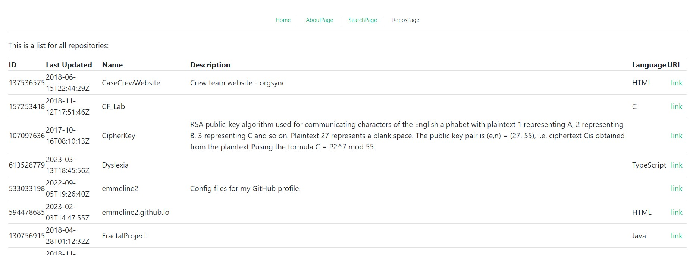

# Project Read Me

To run: 
1. Run `yarn` to check for updated included pacakges.
2. Run `yarn dev`
3. In a separate command window start the server `yarn run server` from within that folder (seethe server ReadMe for more info)

### Dependencies
1. Make sure you have a recent version of node installed
2. Make sure you have yarn installed

The repos page should look like this: 
