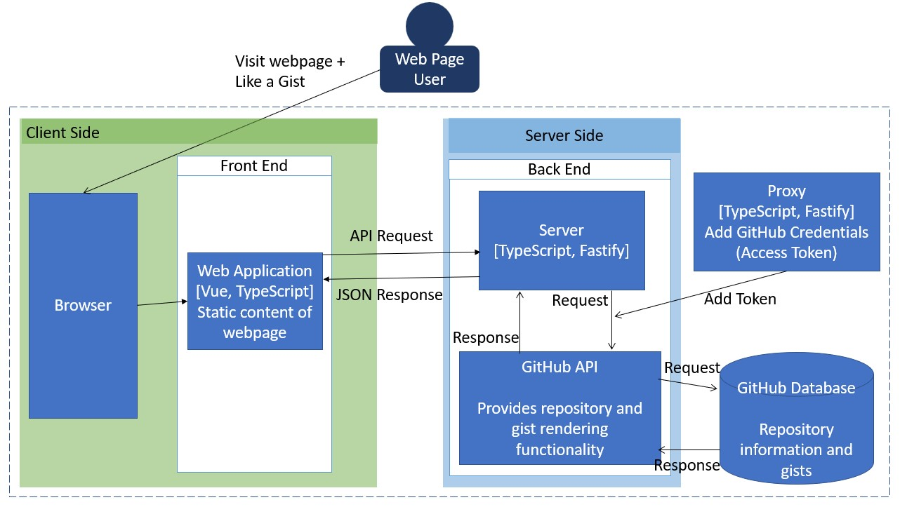

# Project Read Me

To run: 
1. Navigate to the client folder and run `yarn` to check for updated include pacakges.
2. Run `yarn dev` from the same folder.
3. Navigate to the server folder and run `yarn`.
4. Then in the server folder, create a file .env and enter the provided github token in a variable like this: GH_ACCESS_TOKEN=`<token>`
5. Start the server by running `yarn run server` from within the server folder (see the server ReadMe for more info).

### Dependencies
1. Make sure you have a recent version of node installed
2. Make sure you have yarn installed

Architecture Model (ArchitectureModel.pdf):

The repos page should look like this: 
